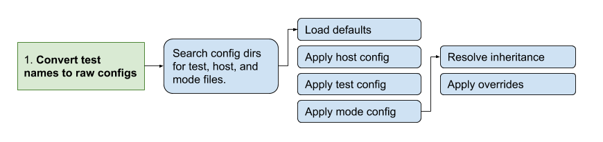
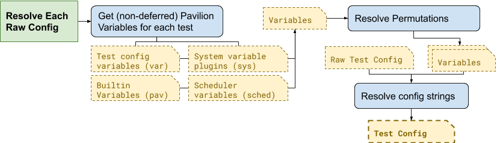
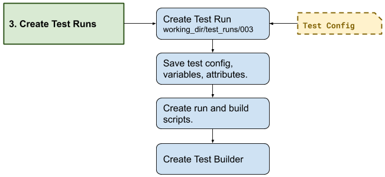

Test Run Lifecycle
==================

This page runs you through the steps that Pavilion takes to run a test,
and the errors you might encounter along the way. The example test uses a
wide variety of features to casually demonstrate when they are resolved along
the way.

.. contents::

Step 0: Our test config and source file
---------------------------------------

You'll often run a test using a test command like this:

.. code-block:: bash

  $ pav run mytests.last_login

In this case, we have a ``mytests.yaml`` test suite file in our tests
directory, that looks like this:

.. code-block:: yaml

  # Make sure each of the users has logged within the last 5 hours, and
  # that their in each of the listed groups on each node.
  user_check:

    # We'll make a virtual test for each user
    permute_on: user

    variables:
      user: ['gary', 'larry', 'jerry']

      groups: ['sudo', 'adm']
      hours: 5
      # Five hours in seconds
      time_limit: '{{ 60^2 * hours }}'

    # Always skip gary.
    not_if:
        '{{user}}': 'jerry'

    build:
      source_location: last_login.zip
      modules: ['gcc', 'openmpi']
      env:
        CC: 'gcc'
      cmds:
        - '${CC} -o last_login last_login.c'

    run:
      env:
        # Pass the user and each group.
        ARGS: '-u {{user}} [~ -g {{group}} ~]'
      modules: ['gcc', 'openmpi']
      cmds:
        - './user_check $ARGS'

    result_parse:
      regex:
        # Extract the last login time.
        last_login:
          regex: 'Last Login: (\d+)'
        # Extract the groups_ok key.
        groups_ok:
          regex: 'Groups OK: (\w+)'

    result_evaluate:
        # Has the user logged in within the time limit?
        login_ok: 'last_login > {{pav.timestamp - time_limit}}'
        # Pass if both the groups are ok and the login was recent.
        result: 'groups_ok == 'yes' and login_ok'

The contents of the ``last_login.zip`` file look like:

.. code-block:: text

  last_login/
    last_login.c
    README

Lastly, let's assume we're on a host called ``tester.my.org``. Let's say our
``sys_name`` plugin returns that name as ``tester``, and we have a
``tester.yaml`` file that looks like:

.. code-block:: yaml

  scheduler: slurm
  slurm:
    num_nodes: 4

Step 1: Test Name -> Raw Config
-------------------------------

The first step Pavilion takes is to convert the test name given to the run
command into a raw test config. A raw config is one that has been completely
loaded, but hasn't been significantly modified.

For every test given as part of the run command, Pavilion will find the
relevant test files and generate a raw config structure.

Finding Suite, Host, and Mode Configs
~~~~~~~~~~~~~~~~~~~~~~~~~~~~~~~~~~~~~

Pavilion can be configured to look in multiple places for test configs
(see :ref:`config.config_dirs`), and uses the first matching file found. In
case, we need a suite config named ``tests/mytests.yaml`` and a host config
named ``hosts/tester.yaml``. Pavilion will load the yaml from each of these
files, and use it to construct our raw test config.

Stacking the Configs
~~~~~~~~~~~~~~~~~~~~

The configs are loaded in the order shown, as documented in
:ref:`tests.format.resolution_order`. Keys specified in the host file override
the defaults, which are overridden by config keys in the test itself.
(:ref:`tests.format.inheritance`) is also resolved here in a similar manner.
Finally, mode configs and command line overrides are applied.

Possible Errors
~~~~~~~~~~~~~~~

Errors at this point will involve missing files, invalid YAML, or invalid
keys in the config.

Missing File
############

Pavilion will tell you which config directories it searched if it can't find
a file.

.. code-block:: bash

    $ ./bin/pav run no_such_test.foo
    Could not find a pavilion config file. Using an empty/default config.
    Could not find test suite no_such_test. Looked in these locations: ['/home/bob/.pavilion', '/usr/local/pav_configs/']

Bad YAML
########

If your YAML formatting is incorrect, you'll see an error like:

.. code-block:: bash

    $ pav run bad_yaml

    Test suite '/usr/local/pav_config/tests/bad_yaml.yaml' has a YAML Error: while parsing a flow mapping
      in "/usr/local/pav_config/tests/bad_yaml.yaml", line 2, column 17
    expected ',' or '}', but got ':'
      in "/usr/local/pav_config/tests/bad_yaml.yaml", line 5, column 13

The line and column number should quickly find the problem.

Bad Keys
########

If your config has keys aren't known/allowed, or you have incorrect
indentation, you'll seen an error like this:

.. code-block:: bash

  $ pav run bad_config
  Test foo in suite /usr/local/pav_config/tests/bad_config.yaml has an error:
  Invalid config key 'build' given under TestConfigLoader called 'slurm'.

In this instance, the 'build' section has the wrong indention level:

.. code-block:: yaml

    bad_keys:
      slurm:
        num_nodes: 5

        build:
          source_location: "bad_keys.zip"
          cmds: "gcc -o bad_keys bad_keys.c"

The Raw Config
~~~~~~~~~~~~~~

The raw config won't look much different from the original YAML. In our case
it will have the contents of the host file added in as well, as well as a
bunch of default values. Pavilion does also add additional 'hidden' keys,
like the full name of the test and the path to it's series file. It will look
something like this:

.. code-block:: json

    {"name": "user_check",
     "build": {"cmds": ["${CC} -o last_login last_login.c"],
               "env": {"CC": "gcc"},
               "modules": ["gcc"],
               "source_location": "last_login.zip"},
     "permute_on": ["user"],
     "scheduler": "slurm",
     "modes": [],
     "subtitle": null,
     "suite": "bad_eval",
     "suite_path": "/usr/local/pav_configs/tests/mytests.yaml",
     "not_if": {"{{user}}": ["jerry"]},
     "only_if": {},
     "slurm": {
        "account": null,
        "avail_states": ["IDLE", "MAINT"],
        "num_nodes": "4",
        "partition": "standard",
        "tasks_per_node": "1",
        "time_limit": null,
        "up_states": ["ALLOCATED", "COMPLETING", "IDLE", "MAINT"]},
     "results": {"evaluate": {
                    "result": "last_login > {{pav.timestamp - time_limit}}"},
                 "regex": [{"key": "last_login",
                            "regex": "Last Login: (\\d+)"}]},
     "run": {"cmds": ["{{sched.test_cmd}} ./test1 $ARGS"],
             "env": {"ARGS": "-u {{user}}"},
             "modules": ["gcc"]},
     "variables": {"hours": 5,
                   "time_limit": "{{ 60^2 * hours }}",
                   "user": ["bob", "dave"]}}

(Note that the above has been pruned for brevity.)

Step 2: Raw Config -> Test Run
------------------------------

During this step, Pavilion gets all the needed variables together, applies
permutations, and generates test run objects and directories.

1. The available variable values are collected for each of the four variable
   types and put in a single *variable manager* for each test
   (:ref:`tests.variables`).
2. These, along with the ``permute_on`` value for a test, is used to compute
   a unique collection of variable values for each
   :ref:`Test Permutation<tests.permutations>`. Each of these will result
   in a separate *Test Run*.
3. The *variable manager* is then used to resolve all the value strings and
   their contained expressions (:ref:`tests.values.config_values`).
   The keys for the :ref:`tests.skip_conditions` are also resolved here.
4. This resolved *test config* will be used to create a test run object.

Possible Errors
~~~~~~~~~~~~~~~

Errors at this step typically involve bad Pavilion strings, missing
variables, or expression errors.

.. code-block:: yaml

    missing_var:
        run:
            # Undefined variable.
            cmds: 'echo {{no_such_var}}'

    syntax1:
        run:
            # Missing closing bracket.
            cmds: 'Oh {{no} dudes'

    syntax2:
        variables:
            world: "earth"

        run:
            # You can't add strings and ints...
            cmds: "hello {{world + 1}}"

.. code-block:: bash

  $ pav run bad_step2.syntax1
  In test syntax1 from /usr/local/pav_config/tests/bad_step2.yaml:
  Error resolving value 'Oh {{no} dudes' in config at 'run.cmds.0':
  Unmatched "{{"
  Oh {{no} dudes
         ^

  $ pav run bad_step2.syntax2
  In test syntax2 from /usr/local/pav_config/tests/bad_step2.yaml:
  Error resolving value 'hello {{world + 1}}' in config at 'run.cmds.0':
  Non-numeric value in math operation
  hello {{world + 1}}
          ^

  $ pav run bad_step2.missing_var
  In test missing_var from /usr/local/pav_config/tests/bad_step2.yaml:
  Error resolving value 'echo {{no_such_var}}' in config at 'run.cmds.0':
  Could not find a variable named 'no_such_var' in any variable set.
  echo {{no_such_var}}
         ^

Deferred Variable Errors
########################

You may also see errors involving :ref:`tests.variables.deferred`. Some
sections, like 'build' and scheduler configuration sections, don't allow them.

.. code-block:: yaml

    mytest:
        build:
            cmds: "This variable is deferred: {{sys.host_name}}"

.. code-block:: yaml

    $ pav run bad_deferred.mytest
    In test mytest from /usr/local/pav_config/tests/bad_step2.yaml:
    Deferred variable in value 'This variable is deferred: {{sys.host_name}}'
    under key 'build.cmds.0' where it isn't allowed

Step 3: Creating the Test Run
-----------------------------

The next step is to create a *Test Run* from each config. A *Test Run* is
both a object in python, and a directory of everything needed to recreate
that object and run the test.

1. The *Test Run* object is created from the config, which immediately grabs
   the next available test_id number. The test run directory is then created
   in a directory named for that number under `<working_dir>/test_runs/`.
2. Everything needed to create the test run object is saved to the test's run
   directory, including the config, test variables, and any other attributes
   of the test.
3. Pavilion then writes a ``build.sh`` script. The run script is generated
   later. The :ref:`tests.build` and :ref:`tests.run` documentation
   thoroughly covers how those are generated.
4. A builder object is created that wraps the test build process.
5. Finally, the test skip conditions are evaluated, to see if this run
   should be skipped.

Possible Errors
~~~~~~~~~~~~~~~

Pavilion validates a few final values in its config at this stage, such as
whether the group specified to run a test under actually exists. These final
validations are fairly rare, however.

Step 4: Building
----------------

Building is covered in full detail in the :ref:`tests.build` section of the
documentation.

Step 5: Kickoff
---------------

At this point the test will be handed to the scheduler plugin dictated by the
test's ``scheduler`` option. (See :ref:`tests.scheduling` for more information
on the basics of scheduler plugins.)

The following steps will be taken:

1) A ``kickoff`` script will be generated by the scheduler for each test run.

   1) The kickoff script will run `pav _run <test_run_id>` and set up
      the basic Pavilion environment.
   #) The extension of the kickoff script is scheduler dependent.
2) The scheduler plugin will run the kickoff script such that
   its contents are run under an allocation. Either the kickoff script itself
   or the command that runs it will set the parameters for that allocation.
3) After all tests are handed off to the scheduler in this way, Pavilion
   exits. The tests will run according to the whims of the scheduler.

Step 6: Test Run
----------------

Once the scheduler decides to give a test an allocation, the kickoff
script's ``pav _run`` command will run the test and gather its
results.

Pavilion first finalizes the test, performing any resolution that could only
occur with full knowledge of the allocation.

1) Resolve any deferred variables for a test.
#) Resolve values in the test config that depended on deferred variables and
   save the updated config.
#) Write any :ref:`tests.run.create_files` defined in the run section.
#) Re-evaluate test skip conditions in case any were deferred.
#) Build the test if it was tagged for remote building.
#) Generate the run script.

Generating the Run Script
~~~~~~~~~~~~~~~~~~~~~~~~~

Run scripts are generated mostly identically to build scripts, and consist
of the same basic components.

1) Manage modules as described in the 'run.modules' options.
2) Manipulate environment variables as set in the 'run.env' options.
3) Run all the commands in `run.cmds`.

For example:

.. code-block:: yaml

    mytest:
        run:
            modules: ['python3']
            env:
                PYTHONPATH: '$PYTHON_PATH:$(pwd)/pylib'
            cmds:
                - python3 mytest.py

would produce a run script that looks like:

.. code-block:: bash

    #!/bin/bash

    # The first (and only) argument of the build script is the test id.
    export TEST_ID=${1:-0}
    export PAV_CONFIG_FILE=/usr/local/pav/config/pavilion.yaml
    source /usr/local/pav/src/bin/pav-lib.bash

    # Perform module related changes to the environment.
    module load python3
    verify_module_loaded $TEST_ID python3

    # Making any environment changes needed.
    export PYTHONPATH=$PYTHONPATH:$(pwd)/pylib

    python mytest.py

Running the Test
~~~~~~~~~~~~~~~~

At this point, Pavilion simply runs the test's ``run.sh`` script. Like with
building, Pavilion will only timeout a test if it doesn't produce output at
least once every ``run.timeout`` seconds.

The return value from the ``run.sh`` script is saved in the 'return_value'
result, and may be used later when we gather the test results.

If this step seems overly simple, it is! Most of the work running Pavilion
tests goes into getting to this point.

Gathering Test Results
~~~~~~~~~~~~~~~~~~~~~~

This is described fully in :ref:`results.basics`.

Mark the Test as Complete
~~~~~~~~~~~~~~~~~~~~~~~~~

Finally, the test is marked as complete by saving a 'RUN_COMPLETE' file in the
test's run directory. Pavilion uses this to quickly determine which tests
might still be running.