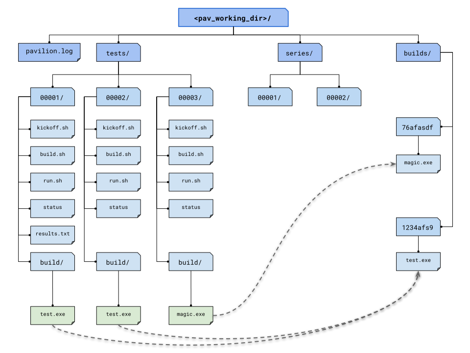

.. _tests.build:

Building Tests
==============

The ``build`` section of the pavilion config defines how a test should
be built . This documentation covers how that's accomplished, as well as
detailed information on the ``build`` config section itself.

.. contents:: Table of Contents

Build Config Keys
-----------------

The documentation for what various keys do is spread throughout this
document.

-  `copy\_files <#copy-files>`__
-  `cmds <#cmds-list>`__
-  `create\_files <#create-files>`__
-  `env <#env-mapping>`__
-  `extra\_files <#extra-files>`__
-  `modules <#modules-list>`__
-  `source\_path <#source-path>`__
-  `source\_url <#source-url>`__
-  `source\_download <#source-download>`__
-  `specificity <#specificity>`__
-  `timeout <#timeout>`__

Building
--------

A build in Pavilion can be as simple as copying a few files, or it may
require downloading software, setting up a build environment, patching,
configuring, and compiling some source. Every build follows the same
steps in Pavilion, though in many cases those steps may be 'empty'. In
addition, Pavilion reuses existing builds where possible, which allows
for skipping most of the build steps.

Downloading Source Files
~~~~~~~~~~~~~~~~~~~~~~~~

You can specify that the test source comes from a URL using the
``source_url`` build option. The ``source_download`` option tells Pavilion
what to do with that url. By default, the download only occurs if the
source file is missing.

source\_url
^^^^^^^^^^^

An HTTP/S or FTP url to use to download the source. Source downloads require
that the Python ``requests`` library and its dependencies be installed (they are
optional). Proxy settings may be configured in the main Pavilion config file.

The source will be downloaded to path given in the ``source_path`` build
option. For relative paths, they will be relative to the
``<config_dir>/test_src/`` directory for the ``<config_dir>`` where the test
suite reside. If ``source_path`` is not given, the download will be placed in
``<config_dir>/test_src/.downloads/<hash>``, where ``<hash>`` is a hash of
the URL.

source\_download
^^^^^^^^^^^^^^^^

This build option tells Pavilion when to download test source.

 - 'missing' - (default) Only if the source can not be found.
 - 'never' - The ``source_url`` is for documentation purposes only.
 - 'latest' - Pavilion will check if the source has changed, and try to update
   it if it has.

Finding Source Files
~~~~~~~~~~~~~~~~~~~~

The primary way to specify source in Pavilion is with the ``source_path``
build option. Additionally you can bring additional files into your build
directory with the ``extra files`` option.

.. code:: yaml

    build_example:
        build:
          source_path: my_test_src.gz

        extra_files:
          - my_test_patch1.patch
          - my_test_patch2.patch

These files are simply found at this stage in the build process. Extraction
and copying occurs when we populate the build directory.

source\_path
^^^^^^^^^^^^

This attribute provides a build with a base archive, directory, or
file to use as the test source. Local files are looked for in all of the
configuration directories in the :ref:`config.config_dirs`, and
the first found is used. How the extracted files are used depends on
the structure of the extracted files themselves.

Archives and Compression
''''''''''''''''''''''''

Pavilion supports archives (.tar), compressed archives (tar.gz), and
simply compressed files (.gz). Archives and compressed file formats are
detected via file-magic (like the Unix ``file`` command). The actual
file name and extensions are ignored.

The following formats are supported:

-  gzip, bzip2, and lzma/lzma2 (.xz) compressed files
-  Similarly compressed tar archives
-  Zip archives

If you don't want an archive automatically extracted, include it under
``extra_files``.

(Bug - There is a bug in the Python zipfile library that prevents extracted
files from getting the correct execute permission bits).

Non-archives
''''''''''''

Pavilion can also copy non-archive files and directories. In this case
the file/directory is simply copied recursively. As mentioned above, a
copied directory will be the build root, but a file will be copied into
the build root.

extra\_files
^^^^^^^^^^^^

This is a list of files that will be found and added
to your build directory. Relative paths are, like with ``source_path``,
searched for relative to ``<config_dir>/test_src``. Unlike the file at
``source_path``, they won't be extracted, simply copied.

create\_files
^^^^^^^^^^^^^

This build attribute lets you create files relative to the build directory
at build time. This is useful for dynamically creating build configuration
files based on test variables.

Note that any existing files with conflicting names will be
overwritten, and any subdirectories in the name will also be created. This
is a dictionary/mapping in yaml, where the key is the file name and the values
is the lines of the file (as a list).

.. code-block:: yaml

    mytest:
      build:
        source_location: mytest.zip
        cmds: 'make'
        create_files:
          'config.txt':
            - 'user: {{pav.user}}'
            - 'scale: 33'
          # Subdirectories can be created.
          'data/file.txt':
            - 'line 1'
            - 'line 2'

Would result in a ``config.txt`` that looks like:

.. code-block:: yaml

    user: bob
    scale: 33

extra\_files
^^^^^^^^^^^^

This build attribute lets you copy additional files into the build
directory. This typically includes patches, external build/run scripts,
or archives that shouldn't be extracted.

Create a Build Script
---------------------

Most of the build config goes into automatically writing a build script.
This script is what sets up the build environment and then runs the
actual build. The script working directory is always the build
directory.

The script is composed in the following order:

- module manipulation
- environment changes
- commands

**Note that the build config (and thus script) can't contain
:ref:`tests.variables.deferred`.**

Not only do we need to know the value of everything to make the build
hash, but the build might not even run in a scheduled environment where
the deferred value is available.

An example config and build script
~~~~~~~~~~~~~~~~~~~~~~~~~~~~~~~~~~

.. code:: yaml

    build-example:
        build:
          source_location: my_test.tar.gz

          modules: [gcc, openmpi]

          env:
            # Add to the path.
            PATH: "${PATH}:$(which gcc)"
            # unset the USER environment variable.
            USER:

          cmds:
            - ./configure
            - ./make

Would result in a script like:

.. code:: bash

    #!/bin/bash

    # This contains utility functions used in Pavilion scripts.
    source /home/bob/pavilion/bin/pav-lib.bash

    # Load the modules, and make sure they're loaded
    module load gcc
    check_module_loaded gcc

    module load openmpi
    check_module_loaded openmpi

    # Set environment variables
    export PATH=${PATH}:$(which gcc)
    unset USER

    # Build the test.
    ./configure
    ./make

modules (list)
^^^^^^^^^^^^^^

Modules to ``module load`` (or swap/remove) from the environment using
your cluster's module system.

For each module listed, a relevant module command will be added to the
build script.

See :ref:`tests.env` for more info.

env (mapping)
^^^^^^^^^^^^^

A mapping of environment variable names to values.

Each environment variable will be set (and exported) to the given value
in the build script. Null/empty values given will unset. In either case,
these are written into the script as bash commands, so values are free
to refer to other bash variables or contain sub-shell escapes.

See :ref:`tests.env.variables` for more info.

cmds (list)
^^^^^^^^^^^

The list of commands to perform the build.

-  Each string in the list is put into the build script as a separate
   line.
-  Each line is a line of BASH, so may reference bash variables set
   in the ENV section or elsewhere.
-  The return value of the last command in this list will be the return
   value of the build script.

   -  The build script return value is one way to denote build success
      or failure.

-  If your script failures don't cascade (a failed ``./configure``
   doesn't result in a failed ``make``, etc), append ``|| exit 1`` to
   your commands as needed. You can also use ``set -e`` to exit on any
   failure.

Generate a Build Hash
~~~~~~~~~~~~~~~~~~~~~

Pavilion uniquely identifies each build by generating a hash based on
the build source and build script. If a build directory with that build
hash exists, then Pavilion simply uses that existing build.

The build hash is composed from:

1) The build script.
#) The build's ``specificity``.
#) The source file or archive gotten using ``source_location``.

   a) Source directories are scanned for changes, rather than recursive hashed.
      The most recent mtime of the directory is hashed.

#) Each of the ``extra_files``.
#) Each of the files generated with ``create_files``.

specificity
^^^^^^^^^^^

Use this field to add additional criteria to the build hash. For
instance, if you'd like your builds to be host specific, you could set
this to ``"{{sys.sys_host}}"``.

Locking the Build
~~~~~~~~~~~~~~~~~

The rest of the build process occurs under the auspices of a lockfile.
This allows the build directory creation, population, and build to occur
without conflicts from other tests that might be trying to create the
same build. This is true even if those tests are running on different
nodes or even entirely different hosts, assuming they all share a
working directory on a shared file system.

-  A build is complete when its '<build_name>.finished' file exists.
-  The build occurs in-place, so builds with absolute RPATHS should continue
   to work after the build is complete.
-  The build script is expected to periodically produce output,
   otherwise Pavilion will assume it deadlocked or otherwise failed and
   release the lock.

timeout
^^^^^^^

How long to wait for build script output before considering the build to be
a failure. Defaults to 30 seconds.

Create and Populate a Build Directory
~~~~~~~~~~~~~~~~~~~~~~~~~~~~~~~~~~~~~

The construction of the build directory is closely tied to the structure
of the extracted contents of the file/directory . These are generally
extracted/copied directly into their final location (once they've been
downloaded). The ``extra_files`` are then copied into that directory, and the
``create_files`` are generated.

There are three basic cases.

No source
^^^^^^^^^

An empty source directory is created.

Single Directory
^^^^^^^^^^^^^^^^

If the file (or extracted archive) is a single directory, that directory
becomes the build directory.

.. code:: bash

    # This tar file has a single top-level directory.
    # The 'src' directory will be the build directory.
    tar -tf src.tar.gz
      src/README.txt
      src/mytest.c

    ls build_dir
      README
      mytest.c

File/s
^^^^^^

In all other cases, the build directory will simply contain the files.

.. code:: bash

    # This tar file has multiple files at the top level.
    # The build directory will contain these files.
    tar -tf src2.tar.gz
      README.txt
      src/mytest.c

    ls build_dir
      README.txt
      src/mytest.c

Deprecated Builds
^^^^^^^^^^^^^^^^^

You can force a rebuild of any relevant builds with the ``--rebuild`` option
to either ``pav run`` or ``pav build``. This will deprecate the existing build
by dropping a ``.pav_deprecated_build`` file into the build directory. Future
tests will ignore that build, in favor of creating a new build under
``builds/<build_hash>-2``, and so on.

Perform the Build
~~~~~~~~~~~~~~~~~

Once the build directory is set up, we can run the build itself.

-  The build can be run either on nodes right before the test runs, or
   on the kickoff host, depending on the value of ``on_nodes``.

   -  Default is to build on the test allocation.
   -  Building on the kickoff host means you find problems really early.

-  To build, pavilion just runs the build script.

   -  The working directory is the build directory.

-  The build is considered successful if the build script exits
   successfully.
-  All regular files in the build directory are given read-only
   permissions.

on\_nodes
^^^^^^^^^

If true (default is false), build the test on an allocation right before the
test is run. Otherwise, build before kicking of the test on the kickoff host.
It's assumed that the kickoff host has an environment (and module
system) comparable to a node.

Copy the Build
~~~~~~~~~~~~~~

Whether a test performs the build or just uses an existing build, each
test needs a copy of the build to run. Instead of actually duplicating
the build, Pavilion creates an identical directory structure with
symlinks to each of the regular files in the build, a **symlink** copy.

   build symlinks

Multiple tests can thus use the same build files, delete build files,
and write new files to the build directory without concern for other
tests. **Tests cannot append to or alter the build files.** They can,
however, freely replace them.

copy\_files
^^^^^^^^^^^

When *copying* files to from the build to the test run's build directory,
actually **copy** these files instead of creating a symlink. Copying large
and/or large quantities of build files will significantly increase Pavilion's
filesystem usage. The items in this list can use standard file globbing
syntax to match multiple files.

.. code-block:: yaml

    mytest:
      build:
        source_location: mytest.zip
        cmds: 'make'
        copy_files:
          # The config.txt file will be an actual file, not a symlink.
          # The test run can alter it as needed.
          - config.txt
          # Filesystem globs are allowed, including "*", "?", and ranges.
          - data/*.dat
          - data/data_?.txt
          - data/data[0-9].json
          # To copy whole directories, use recursive matching "**".
          - libs/**
