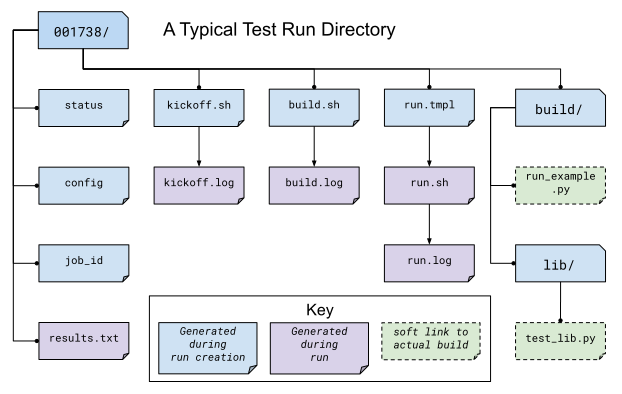

# Running Tests
This page covers how the test `run` section is used to create the test run 
script, and what the lifecycle of a test actually looks like.

 - [Run Configuration](#run-configuration)
 - [Test Run Lifecycle](#test-run-lifecycle)

## Run Configuration

The run section of the test config is used to generate a `run.sh` script, 
which runs the actual test. It's fairly simple, as most of the work involved 
in getting ready to run the test is configured separately.

How these are used to compose a [run script is covered below](#running-runsh).

There are only three attributes:

 - [modules](#modules-list) - Add/remove/swap modules.
 - [env](#env-mapping) - Alter environment variables
 - [cmds](#cmds-list) - Run these commands.
 
#### modules (list)
Modules to `module load` (or swap/remove) from the environment using
your cluster's module system. 

For each module listed, a relevant module command will be added to the build 
script. 

See [Module Environment](env.md#modules) for more info.

#### env (mapping)
A mapping of environment variable names to values. 

Each environment 
variable will be set (and exported) to the given value in the build script. 
Null/empty values given will unset. In either case, these are written into the
script as bash commands, so values are free to refer to other bash variables or
contain sub-shell escapes. 

See [Env Vars](env.md#environment-variables) for more info.

#### cmds (list)
The list of commands to perform the build. 

 - Each string in the list is put into the build script as a separate line.
 - The return value of the last command in this list will be the return value
  of the build script.
    - The build script return value is one way to denote build success or 
    failure.
 - If your script failures don't cascade (a failed `./configure` doesn't 
    result in a  failed `make`, etc), append `|| exit 1` to your commands as 
    needed. You can also use `set -e` to exit on any failure.

  
## Test Run LifeCycle

Every test run in Pavilion undergoes the same basic steps.

 1. [Create a Test Instance](#creating-the-test-run)
 1. [Create the Run Script Template](#create-the-run-script-template)
 1. [Schedule the Test](#scheduling-a-test)
 1. [Build the Test Source](build.md)
 1. [Run the Test Script](#running-runsh)
 1. [Process Test Results](#gathering-results)
 1. [Set the Test as complete](#set-the-test-run-as-complete)
 
Each of these steps has a corresponding test __state__, which is used 
to monitor the progress of each test.


#### Disambiguation
Note the difference between a 'test suite', 'test config', and a 'test run'.
 - A 'test suite' is a config file that can contain multiple raw 'test configs'
 - A 'test config' is the set of attributes used to define a test. 
   - A finalized 'test config' is the config with all the variables, 
   permutations, and other bits resolved. 
 - A 'test run' is a finalized 'test config' turned into an actual, running 
 test.
 - A 'test series' is one or more 'test runs' that were started as a single 
 invocation of the `pav run` command.

This section of the documentation covers the lifecycle of a single 'test run'.

### Creating the Test Run

Each test run created in Pavilion is given a unique **ID**. This **ID** 
corresponds to a directory in `<working_dir>/tests`, which contains 
everything there is to know about a test.



 - __status__ - Contains all the statuses that a test has had. The last 
 listed is the current test status.
 - __config__ - The finalized configuration for the test run, in json.
 - __job_id__ - The job_id assigned by the scheduler. The format depends on 
 the scheduler plugin.
 - __kickoff.sh__ - The kickoff script, written by the scheduler plugin. This
  simply calls pavilion again to run this particular test inside of an 
  allocation. The extension may vary depending on the scheduler plugin.
 - __build.sh__ - The [build script](build.md#create-a-build-script).
 - __run.tmpl__ - The [run script template](#create-the-run-script-template).
 - __run.sh__ - The final run script.
 - __(kickoff/build/run).log__ - The stdout and stderr of each of the above
  scripts when they were run.
 - __build__ - The build directory. The test will run within this directory.
   - The files in here are softlinks to the 
     [actual build](build.md#copy-the-build). 

### Create the Run Script Template

Because the run config can contain 
[Deferred Variables](variables.md#deferred-variables), we'll need to 
replace those variable values with their actual values once the run is in an
allocation. As a result, we first generate a run script template using the 
run config. 

```yaml
run_example:
    build: 
      source_location: run_example

    run:
      modules: [python]
      env: 
        PYTHONPATH: ./libs
      
      cmds:
        # Host CPU's is a deferred variable.
        - python run_example.py {{sys.host_cpus}}
```

would result in a run script template that looks like: 

```bash
#!/bin/bash

# This contains utility functions used in Pavilion scripts.
source /home/bob/pavilion/bin/pav-lib.bash

# Load the modules, and make sure they're loaded 
module load python
check_module_loaded python

# Set environment variables
export PYTHONPATH=./lib

# Run the test cmds
python run_example.py [\x1bsys.host_cpus\x1b]
```

Once in an allocation, pavilion will replace the escaped sys.host_cpus reference
with the actual value. 

### Scheduling a Test

When you run a 'test series', each test is scheduled separately and gets a 
separate allocation. Pavilion leaves it up to the scheduler plugin, and the 
scheduler itself, to handle exactly when and how a test is scheduled. Each 
test's scheduler configuration section determines the exact setting used by 
the scheduler plugin when scheduling a test.

Generally speaking, scheduler plugins write a **kickoff** script and tell
their scheduler to run that script. These scripts simply use Pavilion to 
perform the actual test run for the specific test ID using the super-secret
`pav _run <run id>` command.

```bash
#!/bin/bash
#SBATCH --job-name "pav test #3"
#SBATCH -p standard
#SBATCH -N 2-2
#SBATCH --tasks-per-node=2

# Redirect all output to kickoff.log
exec >/usr/projects/hpctest/pav2/working_dir/tests/0000003/kickoff.log 2>&1
export PATH=/home/bob/pavilion/src/bin:${PATH}
export PAV_CONFIG_FILE=/home/bob/.pavilion/pavilion.yaml
pav _run 3
```

#### slurm
For the existing __slurm__ scheduler, this means writing an sbatch script 
(`kickoff.sbatch`), and scheduling it via the sbatch command. Since slurm 
sbatch script allows us to set all options within the script, we do so to 
allow for easier debugging of Pavilion.

It's up to the Pavilion user to make sure the test's slurm settings are such 
that the test will eventually get an allocation.

#### raw
The __raw__ scheduler simply runs tests as an independent sub-process. It can
let them all run simultaneously, or limit them to one-at-time depending on 
the scheduler settings.

### Running run.sh
Within the `pav _run` command, after we've [build the test src](build.md) and 
resolved `run.tmpl` into the final `run.sh` script, we simply have to run it. 

 - The script is run in the default login environment of the user.
 - The return value of the script, which is the return value of the script's 
 last command by default, is the default PASS/FAIL result of the script.

### Gathering Results

After the test completes, Pavilion gathers the results. It does this whether 
the test passed or failed, but not if Pavilion encountered an error during 
the run.

The results, both those gathered by default and through result parsers, are 
compiled into a single JSON object and written to `results.txt`, and logged 
to the [result log](../config.md#result_log).

### Set the Test Run as Complete
Lastly, the test run is set as complete, regardless of whether it passed, 
failed, or encountered an error. Note that this is separate from the status 
file; a file named 'RUN_COMPLETE' is created in the test run directory. The 
file contains only a timestamp of when the run officially ended. Various 
commands can use this as an easy way to differentiate complete tests from 
those that may still be running.