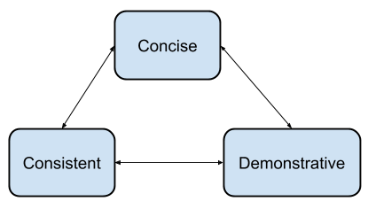

Writing software documentation
==============================

This page is meant to serve as both a tutorial for writing documentation and
an example of what that documentation should look like. For example, each
page should start with a top-level header, an introductory paragraph or two, and
a table of contents.

.. contents::

Overview
--------

The overview should tell the reader how all the pieces fit together.
In this case our goal is to give the user documentation that is
**consistent**, **concise**, and **demonstrative**. This is a good place for
one or more diagrams to demonstrate how this part relates to the rest of the
system, or how the parts of this document relate to one another.



   The purpose of this diagram is to demonstrate the use of diagrams, and
   to show that captions should be used to explain each diagram's purpose.
   This was generated using the 'Drawing' app in Google Docs.

Requirements
------------


For tutorials like this one, you generally want to start with a list of
requirements so that the reader can get together everything they need to
follow along. It might include things like links to
:ref:`installing-pavilion` and a bulleted list of requirements:

 - Basic familiarity with Restructured Text and Sphinx

   - Sphinx has nice `Sphinxified ReST documentation`_.
 - Also see ``docs/README.md`` for instructions on building and debugging the
   doc tree.
 - A copy of the source of this document.

   - While this isn't a lesson on *how* to use Sphinx/ReST, I do try to
     demonstrate in this document as many features as I can.
 - *(optional)* You may want to include optional requirements that will
   make life easier for the reader.

For non-tutorial documentation, you can assume by that point the user has the
system set up.

.. _Sphinxified ReST documentation:  http://www.sphinx-doc.org/en/master/usage/restructuredtext/basics.html

Concise
-------

Users should be able to find the information they need in the documentation
as quickly as possible. :ref:`Consistent` style and structure along with
:ref:`demonstrative` examples are the cornerstones of concise documentation
and are covered in their own sections. Here, for brevity's sake, are a few
additional pointers:

- The purpose of every sentence in documentation should be to convey relevant
  information.

  - No fluff.
  - No sales pitches.
  - Save the jokes for code comments.
- Use links to tie-in additional concepts rather than re-explaining.
- If two concepts differ only slightly, fully document one. For the second,
  refer to the first and note the differences.

.. _Consistent:

Consistent
----------

All of the documentation should be written in the same basic voice. This
includes using a consistent tone, tense, style, and word choices.
`Google's developer documentation style guide <https://developers.google.com/style/tone>`_ thoroughly covers this
subject, and should be considered the style guide for Pavilion
documentation as well.

Here are some sections that are particularly important:

- `Style and Tone <https://developers.google.com/style/tone>`_
- `Present Tense <https://developers.google.com/style/tense>`_
- `Pronouns <https://developers.google.com/style/pronouns>`_
- `Second Person <https://developers.google.com/style/person>`_

Structure
^^^^^^^^^

Structure each document fractally. Each document should have a well defined
subject, divided into sub-sections with well defined subjects, that are
themselves sub-divided either into further sub-sub-sections or paragraphs.

While the above may seem trivial, it forms the foundation for how to approach
writing documentation.

1. Very briefly summarize the document in the header.
2. Outline the sub-topics by creating section headers.
3. Write an introduction/overview that ties the sub-topics together.
4. Write each sub-topic as if it is its own document, starting from step 1.

   - When the ideas are too small for sub-sections, then it is time to
     write paragraphs.
   - If the ideas in a document require more than 4 levels of headings,
     you may need to consider moving topics to their own documentation pages.
   - In contrast, document length should not be a reason to break up a page.
   - For very small ideas with little content, use a dictionary list.


Headings
````````
Headings should tell the user precisely what the section is about, given
the context of the heading structure. You'll have a table of contents
to reinforce this hierarchy. Headings should be in 'sentence case'.

- Bad example: "Writing the source". What source?
- Better example: "Writing a result parser module". That module.
- Best example: "Result parser module" within a "Plugin Files" section in a
  tutorial document about writing result parser plugins. We
  know by context this a plugin file and that we'll be writing it.

Documentation Type
``````````````````
There are four types of documentation within Pavilion:

Usage
  The purpose of usage documentation is to give the reader a quick
  introduction to the overall structure of Pavilion. It should not try to
  completely document any subject, and should instead link to the **Feature**
  documentation on that topic. It may be mildly conversational in tone. Most
  directories have a "basics" document that is of this type.
Tutorial
  Tutorials are meant to guide the user through the process of using the
  software or adding to it. They may be mildly conversational in tone. They
  should be concise but *complete*. They should cover each step in the
  process, why that step exists, what happens when things go right, and
  how to resolve issues when things go wrong.
Feature
  Feature documentation should attempt to completely detail how to use each
  feature of the software. It may, when necessary, cover limits or other
  considerations imposed by implementation details. It should be as concise
  as possible, and should not be conversational in tone.
API
  API documentation is primarily written as part of the code. It is organized
  by hand in documents under ``docs/source``, but the content is generated
  from doc-strings using Sphinx's autodoc feature. Every source file,
  class, method, and function should be documented here. Function/methods
  should have their arguments, return values, and raised exceptions documented.
  Public globals, class, and instance variables should also be documented.

Audience
````````
The audience for Pavilion and its documentation is a technical one. You can
generally assume the your audience understands at least the following:

- Basic computer science concepts like regular expressions.
- Shell scripting.
- YAML
- Cluster computing and schedulers
- (Plugin Tutorials) Python basics including classes


.. _demonstrative:

Demonstrative
-------------

It is often much faster to show than to tell, and readers will frequently
read nothing but your example code and infer the rest. Such code should be
well-documented and broad, condensing everything needed into a few
comprehensive examples.

- Examples should be highlighted according the the language they're written in.

  - Sphinx requires that such code be a valid snippet for that language.
- You don't need to introduce examples. Simply end the last sentence of the
  preceding paragraph with a colon ``":"``.
- Most lines should have an explanatory comment.
- Where ellipsis would be used to denote that the example is an excerpt,
  a comment should state that instead.
- Identifiers in the example should be named in a self-documenting manner.
- Examples should show both how to use a feature, and document or show
  (with additional code) the expected result.
- Formats that don't allow comments, like JSON, will require outside
  explanation.

The simple example
------------------

A simple example provides the foundational knowledge needed to understand
a concept or feature, and should generally cram in as many sub-concepts as
possible:

.. code-block:: yaml

    my_test_cfg:

      run:
        # We can set, modify, and unset environment variables.
        # All environment variables set will be "exported".
        # This may also be done in the "build" section.
        env:
          # Set http_proxy
          http_proxy: "http://example.com:8080"

          # Unset https_proxy.
          # Setting to YAML "null" (not the string "null") is equivalent.
          https_proxy:

        # The rest of the test would follow.

This would produce a run script that contains:

.. code-block:: bash

  # Set variables are double quoted to avoid issues with special characters.
  export http_proxy="http://example.com:8080"
  unset https_proxy

Advanced examples
-----------------

Examples should build on each other, and the should assume knowledge of
prior examples.

.. code-block:: yaml

      # These are directly written into a bash script, so any bash
      # code is fine (be carefully about escapes).
      # Note: Errors will not result in a run script failure.
      wget_exe: "$(which wget)"

      # These are executed in order, and can reference each other as well
      # as other environment variables.
      WGET_CMD: "${wget_exe} -f -q"

This would produce a run script that contains:

.. code-block:: bash

  export wget_exe="$(which_wget)"
  export WGET_CMD="${wget_exe} -f -q"

Technical Problems
------------------

This section covers technical issues that need to be solved in restructured
text in a common way.

.. _tutorials.writing_docs.links:

Links
^^^^^

.. _sphinx-inline: https://www.sphinx-doc.org/en/1.7/markup/inline.html

There are multiple, inconsistent ways create links in restructured text.
Pavilion docs should use `labels` to define both internal and external
resources, and `sphinx-inline`_ to reference them.
This :ref:`tutorials.writing_docs.links` section, by way of demonstration, shows
how to best create links in Pavilion docs. The source of this
:ref:`tutorials.writing_docs.links` section is provided in a code block below.

Link Targets
````````````

Link targets appear as: ``.. _<target_name>: [target_url]``

.. _tutorials.writing_docs.link_target_rules:

- Targets must start on a new line.
- The target name can contain spaces, and is case sensitive.

  - By default the target name is the text that will appear as the link text.
  - Targets that appear before a section header will have the header name as
    the link text instead.
- Target names must be unique across all of the documentation.
- The target URL is optional, the colon is always required.

  - Without a target URL, the link acts as an anchor that you can reference
    else where in the docs.
  - These anchors should contain the dot-separated path to the file in the
    name, to ensure uniqueness. IE: ``.. tests.env.my_ref_name:``

Link References
```````````````

.. _tutorials.writing_docs.ref_examples:

- The ``:ref:`` tag tells sphinx to handle internal references which allows for
  accessing labels across documents. Use it for both internal and external
  links. In this case, the section name is the link text.

  - ``:ref:`test.format``` -> :ref:`tests.format`
- Refs to non-section labels must include the link text.

  - ``:ref:`ref examples <tutorials.writing_docs.ref_examples>```
    :ref:`ref examples <tutorials.writing_docs.ref_examples>`
- External links should use the basic restructured text format.

  - ```sphinx-inline`_`` -> `sphinx-inline`_
